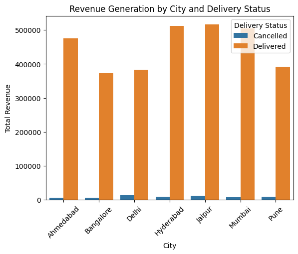
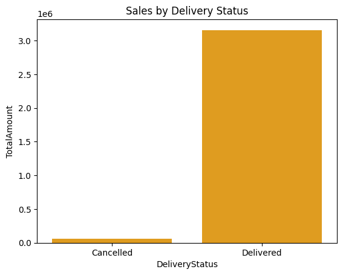
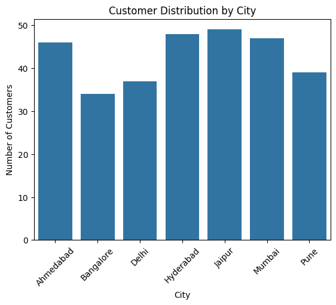
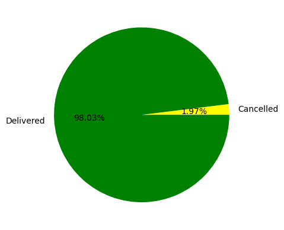
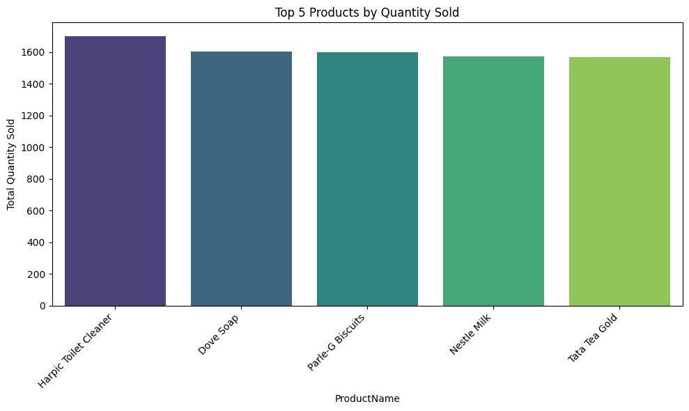
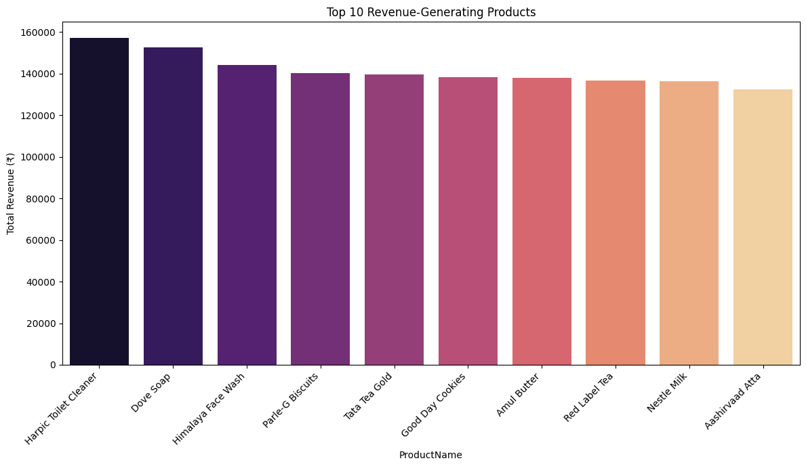

# 🛒 Swiggy Instamart Data Analysis

> A comprehensive exploratory data analysis (EDA) of Swiggy Instamart customer, order, and product data using Python and Google Colab.

## 📌 Overview

This project performs an in-depth exploratory data analysis (EDA) on Swiggy Instamart datasets, including customer orders, order details, and delivery status. The goal is to uncover patterns such as:

- Revenue generation by city
- Delivery performance
- Customer distribution across cities
- Sales trends

The analysis was conducted using **Google Colab**, with visualizations powered by **Matplotlib** and **Seaborn**.

---

## 🗂️ Datasets Used

| File Name          | Description                                      |
|--------------------|--------------------------------------------------|
| `Customers.csv`    | Contains customer information like ID, name, city, address, phone number |
| `Orders.csv`       | Includes order details: OrderID, CustomerID, OrderDateTime, TotalAmount, DeliveryStatus |
| `OrderDetails.csv` | Item-level breakdown of each order: ProductName, Quantity, PricePerUnit |

---

## 🔧 Tools & Libraries

- **Python**
- **Pandas** – For data manipulation and aggregation
- **NumPy** – For numerical operations
- **Matplotlib & Seaborn** – For data visualization
- **Google Colab** – For interactive notebook execution and visualization

---

## 📊 Key Insights

### 1. **Customer Distribution by City**
- Most customers are located in **Mumbai**, **Delhi**, and **Bangalore**

### 2. **Revenue by City**
- Mumbai and Bangalore contribute the most to total revenue.
- Visualized using bar charts and pie charts.

### 3. **Delivery Status Analysis**
- Most orders are successfully delivered.
- Canceled orders were analyzed to understand failure points.

### 4. **Sales by Delivery Status**
- Delivered orders generated **₹3,157,184**
- Cancelled orders accounted for **₹63,304**
  
### 📊 Sample Visualizations
# Swiggy Instamart Data Analysis

## 📊 Key Visualizations

Here are some key visualizations from the analysis:

#### 1. Revenue by City


#### 2. Revenue by City and delivery status
.

#### 3. Sales by Delivery Status


#### 4. Customer Distribution by City


#### 5. Order Status Distribution


#### 6. Top Products by Quantity Sold


#### 7. Daily Order Trends


#### 8. Average Order Value by City


#### 9. Revenue Contribution by Product


---

## 📁 Folder Structure
```
Swiggy-Instamart-Analysis/
├── Customers.csv
├── Orders.csv
├── OrderDetails.csv
├── Swiggy.ipynb # Google Colab notebook
└── README.md # This file
```
---

## ▶️ How to Run

1. Clone the repository:
   ```bash
   git clone https://github.com/your-username/Swiggy-Instamart-Analysis.git

2. Open Swiggy.ipynb in Google Colab .
3. Upload the dataset files (Customers.csv, Orders.csv, OrderDetails.csv) or connect to Google Drive.
4. Run all cells to perform EDA and visualize results.

## 🚀 Future Improvements
1. Perform time-series analysis on daily/monthly order trends
2. Use machine learning to predict delivery delays or cancellations
3. Build an interactive dashboard using Plotly/Dash or Streamlit
## 🤝 Contributions
Contributions are welcome! If you'd like to enhance this analysis or add more visualizations, feel free to fork the repo and submit a pull request.
